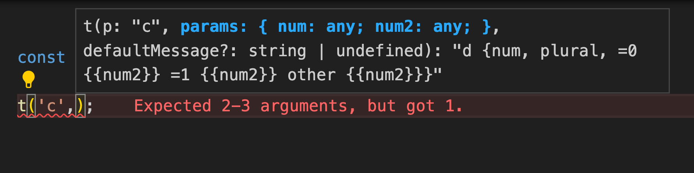
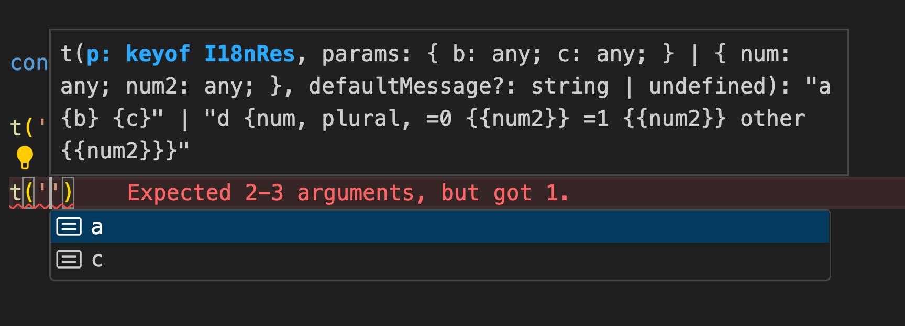
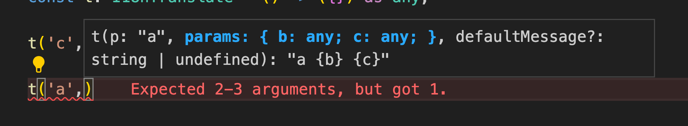
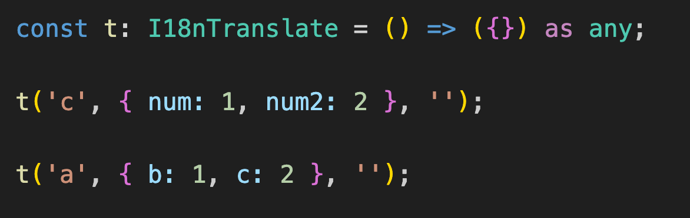

# typed-icu-message

transform icu language message json to typescript type definition

[](http://badge.fury.io/js/typed-icu-message)
[](https://npmjs.org/package/typed-icu-message)

## demo





## usage

```shell
npm install typed-icu-message
```

```typescript
import { getTsTypesFromRes } from 'typed-icu-message';

const code = getTsTypesFromRes({
    zh: {
        'a': '一 {b} {c}',
        'c': '二 {num, plural, =0 {{num2}} =1 {{num2}} other {{num2}}}'
    },
    en: {
        'a': 'one {b} {c}',
        'c': 'two {num, plural, =0 {{num2}} =1 {{num2}} other {{num2}}}'
    }
});
```

generated code:
```typescript

/* eslint-disable */
export interface I18nRes {

  "a": {
    returnType: "一 {b} {c}" | "one {b} {c}";

    variableType: {
      "b": any;
      "c": any;
    };
  }
  "c": {
    returnType: "二 {num, plural, =0 {{num2}} =1 {{num2}} other {{num2}}}" | "two {num, plural, =0 {{num2}} =1 {{num2}} other {{num2}}}";

    variableType: {
      "num": number;
      "num2": any;
    };
  }
}

export type I18nResKeys = keyof I18nRes;

export type I18nTranslate = <T extends I18nResKeys>(
  p: T,
  params: I18nRes[T]['variableType'],
  defaultMessage?: string,
) => I18nRes[T]['returnType'];
```
